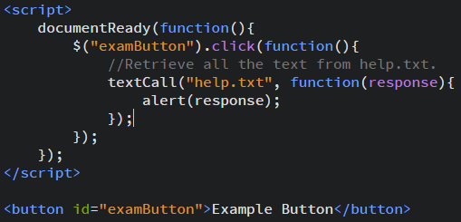
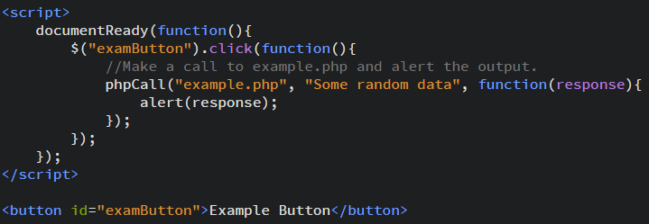
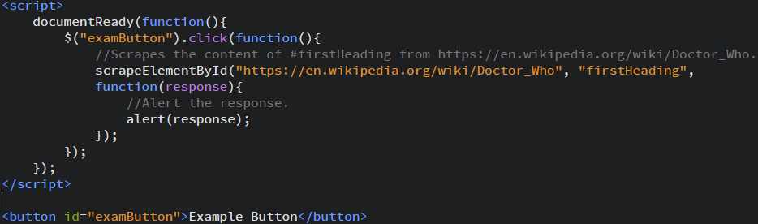
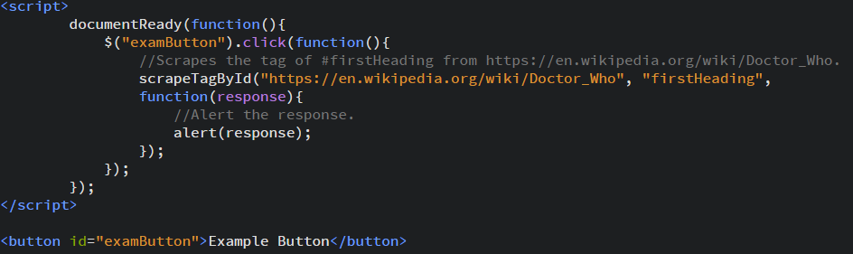
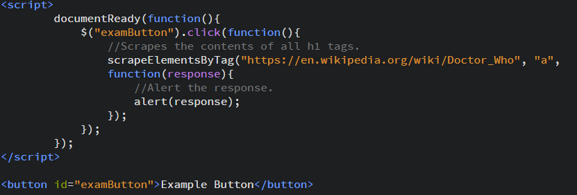
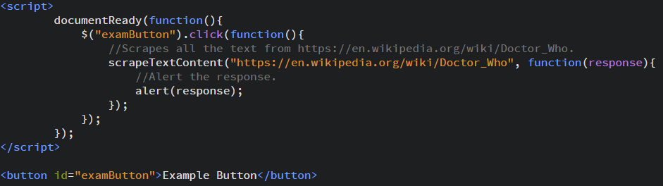
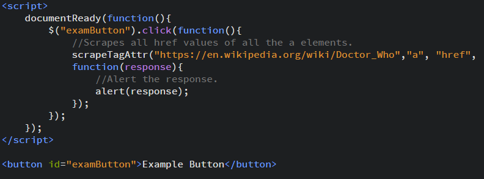

# JamDrop
A free and open source JavaScript library for server-side programming and DOM manipulation. 

<b>Version: 1.0.0.</b>
 
<b>Creator: James Ryan</b>
 
<b>Date: 09/03/2018</b>

JamDrop is a free and open source Javascript library built for DOM manipulation and basic server-side operations.

<h2><b>Model</b></h2>

JamDrop uses an ID selector model for DOM manipulation similar to that of jQuery's.
Below is an example of how to change the background of a div once clicked.

All server-side operations are done using a function based model.

<h2><b>Dependencies</b></h2>

JamDrop requires no code dependencies but does require a window.

<h2><b>DOM Documentation</b></h2>

<code>.background(colour/image)</code> - Changes the background colour/image of a given element.

<code>.click(function)</code> - Detects an element being clicked (event handler).

<code>.mouseOver(function)</code> - Detects the mouse hovering over an element (event handler).

<code>.mouseOut(function)</code> - Detects the mouse leaving the element.

<code>.moveRight(pixels)</code> - Moves a specified element right by a given amount of pixels.

<code>.kill()</code> - Completely removes a specified element from the DOM.

<code>.drain()</code> - Kills all the children of an element.

<code>.elevate(pixels, colour)</code> - Increases the box shadow of an element by a specified amount.

<code>.createChild(element)</code> - Creates a specified child element within the current element.

<code>.getAttr(attribute)</code> - Gets a specified attribute from an element.

<code>.centerText()</code> - Centres the text within a specified element.

<code>.center()</code> - Centers a specified element within a parent element.

<code>.color()</code> - Changes the text colour of a specified element.

<code>.font(newFont)</code> - Changes the font of a specified element.

<code>.fontSize(pixels)</code> - Changes the font size of an element.

<code>.width()</code> - Changes the width of a specified element.

<code>.height()</code> - Changes the height of a specified element.

<code>.setContent()</code> - Changes the inner html code of a specified element.

<code>.getText()</code> - Gets the text content of a current element.

<code>.getCss(styling)</code> - Gets certain styling attributes of a specified element.

<code>documentReady(function)</code> - Detects whether the document is ready. All JamDrop code must be written within this function.
  
<code>windowLocation(url)</code> - Changes the current location of the browser to a new url whether it be local or external.

<code>explode(string)</code> - Turns a specified string into an array of characters.

<code>indexOf(int/string/item, array)</code> - Finds the index of a certain item within a specified array.

<code>mergeArray(array, array)</code> - Combines two specified arrays into one array.

<code>arrayToString(array)</code> - Converts an array to a string.

<code>drainArray(array)</code> - Wipes/empties a specified array.

<h2><b>Server-Side Documentation</b></h2>

<code>textCall(textfile, success function(response))</code> - Retrieves text from a specified text file.

<code>phpCall(phpfile, datatosend, success function(response))</code> - Makes a call to a specified php file.

<code>scrapeElementById(url, id, success function(response))</code> - Scrapes the content of a specified element on a specified webpage.

<code>scrapeTagById(url, id, success function(response))</code> - Scrapes the tag (element type) of an id on a specified webpage.

<code>scrapeElementsByTag(url, tagname, success function(response))</code> - Scrapes all elements of a certain tag from a webpage.

          
<code>scrapeTextContent(url, success function(repsonse))</code> - Scrapes all text content from a specified webpage/url.

<code>scrapeTagAttr(url, tagname, attribute, success function(repsonse))</code> - Scrapes a specified attribute from all tags on a url.

